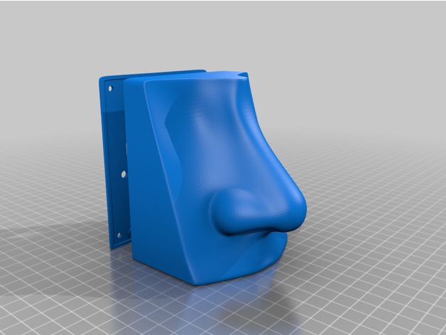
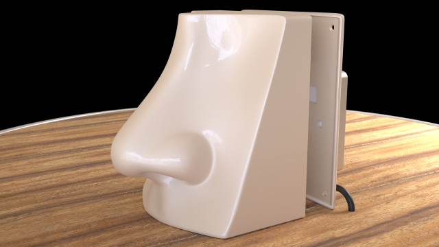
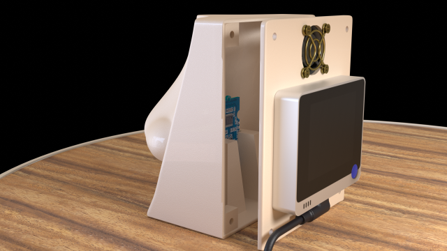

# Artificial Nose 3D Enclosure

The [main part](nose.stl) (i.e. the 👃 itself) includes a mounting slot for a Grove Multi-channel gas sensor. The [back plate](nose%20back%20plate.stl) that allows to attach a 25mm fan and a Wio Terminal.

## Images

## License & Credits

The STL files are made available under the terms of the 
[Creative Commons Attribution 4.0 International License][cc-by].

[![CC BY 4.0][cc-by-image]][cc-by]

The original design for the nose, before I turned it into an actual enclosure, is from **Stefan Potrovic** (a.k.a. [monochroma380](https://sketchfab.com/monochroma380)) and can be found on [SketchFab](https://sketchfab.com/3d-models/nose-model-3-f9a65e76ae52415591d63a51666194d5). A huge thanks to him for the original work, and for allowing me to publish the derivative work.

[cc-by]: http://creativecommons.org/licenses/by/4.0/
[cc-by-image]: https://i.creativecommons.org/l/by/4.0/88x31.png
